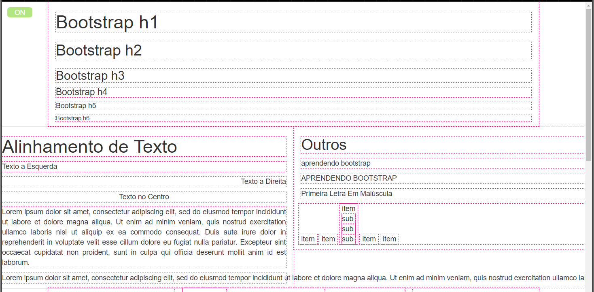

# ShowLimits
Mostra os limites dos elementos HTML. Contorna os Elementos com uma linha tracejada.

<pre>Basicamente adiciona o seguinte código:
<code>\* {
    outline-style: dashed;
    outline-color: #FF1493;
    outline-width: 1px;
 }</code><pre>
 
Foi adicionado um botão no canto superior esquerdo para injetar o código acima.

Adicione no final da tag "body"

