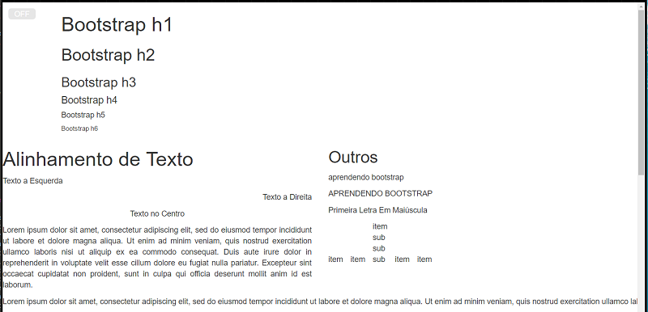

# ShowLimits
Mostra os limites dos elementos HTML. Contorna os Elementos com uma linha tracejada.

Basicamente adiciona o seguinte código:
```css
* {
    outline-style: dashed;
    outline-color: #FF1493;
    outline-width: 1px;
}
``` 

Foi adicionado um botão  no canto superior esquerdo para injetar o código acima.

Para utiliar, adicione antes da tag `</body>`.
```html
<body>
    <!-- my page -->
    <script src="https://code.jquery.com/jquery-3.1.1.min.js"></script>
    <script src='https://gamts.github.io/ShowLimits/showlimits.js'></script>
</body>
```

Necessário jQuery.

[Exemplo](https://gamts.github.io/ShowLimits/exemplo/exemplo.html){target="_blank"}




